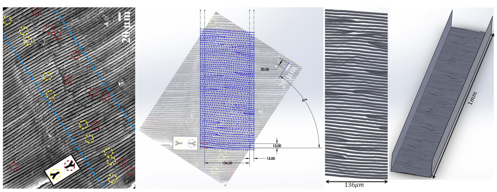
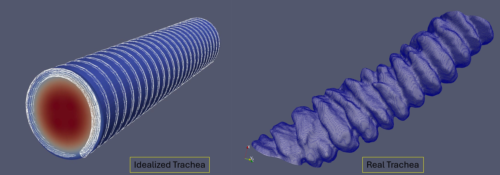
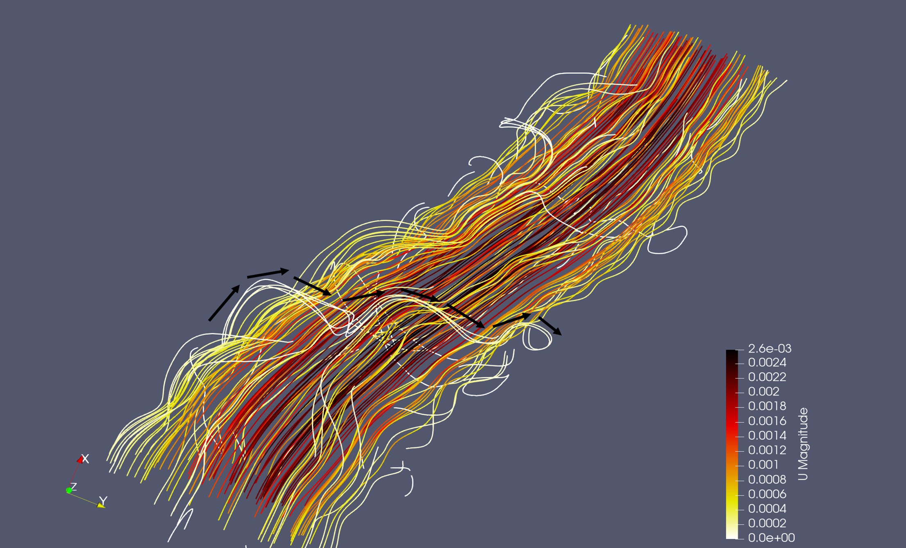
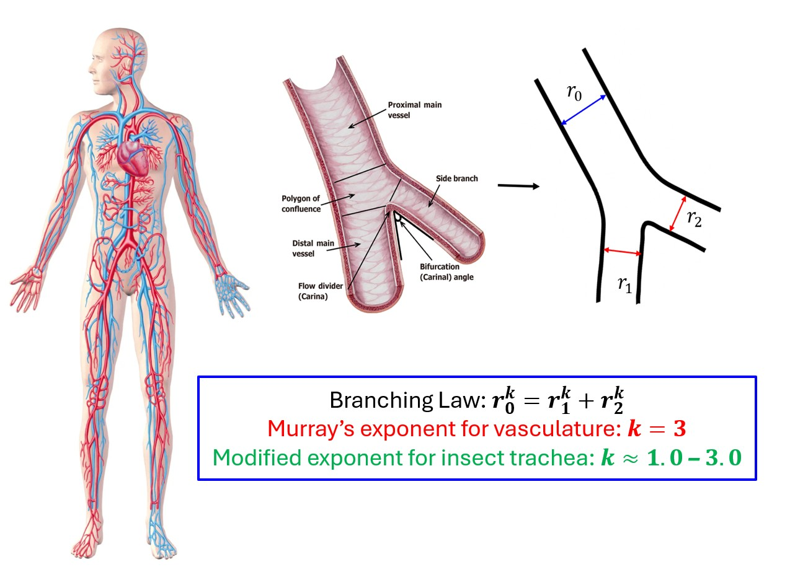
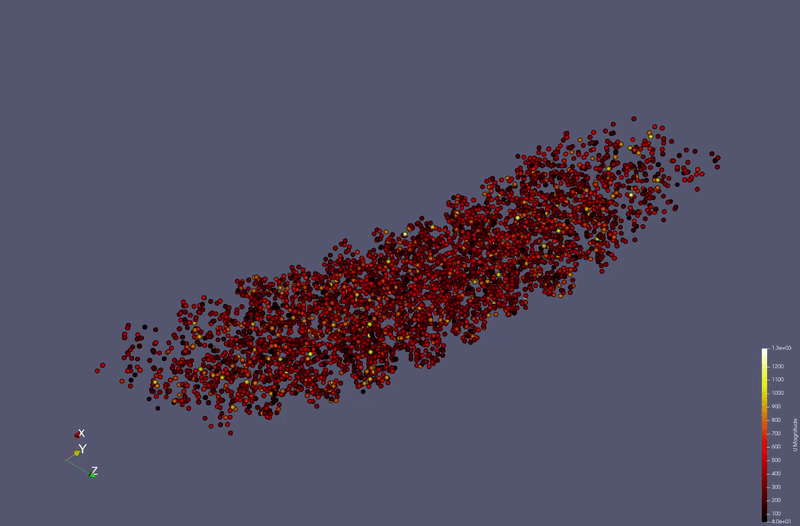

Insects transport oxygen through an intricate network of air-filled tubes known as tracheae. Unlike vertebrates, this system delivers oxygen directly to tissues without relying on blood circulation. This project combines computational fluid dynamics, rarefied gas simulations, and theoretical transport modeling to investigate how microscale biological structures influence respiratory transport and network optimization.

**This project was supported by U.S. National Science Foundation (NSF) and Virginia Tech's Biological Transport (BIOTRANS) program.**

<!--more-->

## Background & Motivation

The insect respiratory system contains complex internal wall structures known as *taenidia* — periodic rib-like features that support the tracheal walls while strongly influencing microscale flow behavior. Despite their prevalence across insect species, the fluid mechanical role of these structures remains poorly understood.

This project investigates how realistic tracheal geometry, wall morphology, and rarefaction effects alter flow and transport behavior across insect respiratory networks.

---

## Computational Framework & Methods

### Literature-Guided Geometry Development

The project began with an extensive review of insect respiratory physiology, tracheal morphology, and microscale transport literature to identify biologically relevant geometric and transport mechanisms.

Using **SolidWorks**, biologically inspired tracheal geometries with realistic taenidial wall features were reconstructed to study their influence on flow and transport.

  <figure>
    
    <figcaption>
      Literature-guided CAD reconstruction of an insect tracheal segment with realistic taenidial wall features developed in SolidWorks for computational flow analysis.
    </figcaption>
  </figure>

---

### CFD Simulations in Idealized and Realistic Tracheal Models

To isolate the role of fine biological structures, two parallel computational models were developed:

- **Realistic tracheal geometries** reconstructed from high-resolution experimental imaging
- **Equivalent idealized geometries** with simplified smooth walls and matched global dimensions

This enabled direct comparison between biologically accurate and simplified respiratory models.

We collaborated with experimental researchers who provided highly resolved 3D tracheal imaging datasets acquired at Argonne National Laboratory. These datasets were processed and converted into computational domains for CFD analysis. 

  <figure>
    
    <figcaption>
      Realistic tracheal model based on 3D X-ray synchrotron images and their idealized counterpart modeled in SolidWorks.
    </figcaption>
  </figure>

Meshes were generated using:

- **snappyHexMesh** for OpenFOAM-compatible volumetric meshing
- **Meshmixer** for geometry cleanup and surface processing

Flow and transport simulations were performed using **OpenFOAM**, while **ParaView** was used for post-processing and visualization.

Additional analysis workflows were developed in **Python** for:
- transport quantification
- streamline analysis
- enhancement-factor calculations
- parametric studies
- automated data processing

---

### Key Findings from CFD Analysis

Comparisons between realistic and idealized tracheal models revealed:

- Significant enhancement in flow transport within realistic tracheal geometries
- Strong local mixing induced by taenidial wall structures
- Geometry-driven alterations in streamline topology and near-wall transport
- Enhanced advective and diffusive transport relative to smooth-wall counterparts

These results demonstrated that microscale biological wall features play an active transport role rather than serving only structural purposes.

  <figure>
    
    <figcaption>
      Realistic tracheal model shows helical streamlines representing momentum shift due to teanidial windings.
    </figcaption>
  </figure>

---

## Modified Murray’s Law for Insect Respiratory Systems

In parallel with CFD investigations, a theoretical framework was developed to extend classical Murray’s law for insect respiratory transport.

The formulation incorporates:

- simultaneous advection and diffusion
- rarefaction-induced slip effects
- Knudsen transport mechanisms
- metabolic maintenance cost
- insect-specific respiratory geometry

The resulting framework predicts branching behavior beyond classical cubic Murray scaling and connects transport optimization directly to microscale respiratory physics.

  <figure>
    
    <figcaption>
      Modified Murray's formulation explains why insect respiratory transport deviates from classical Murray's law
    </figcaption>
  </figure>

---

## Rarefied Gas Simulations & Oscillatory Transport

To further investigate microscale respiratory pumping mechanisms, rarefied gas simulations were performed using DSMC-based methods.

  <figure>
    
    <figcaption>
      Pulsating wall exhibits bias on the direction of particle movement representing asymmetry due to taenidial structure
    </figcaption>
  </figure>

Using oscillatory wall motion within tracheal geometries containing heterogeneous taenidial structures, simulations demonstrated that:

- periodic wall pulsing alone can generate directional transport
- asymmetric wall morphology induces preferential flow behavior
- microscale wall structures may contribute directly to respiratory pumping efficiency

These simulations provide a potential physical explanation for directional transport generation in deformable insect respiratory systems.

---

## Publications & Research Output

This project has contributed to journal publications, conference proceedings, posters, and invited research presentations related to insect respiration, bio-inspired transport, microscale flow physics, and modified Murray’s law.

### Journal Articles

- Saadbin Khan, Anne E Staples (2026). [A tidal Murray’s law framework inspired by insect respiration](/publications/j_khan2026). *Nature Physics* (In preparation).

- Melissa C Kenny, Laura A Miller, Mark A Stremler, Anne E Staples, Saadbin Khan, John J Socha (2025). [Does Murray’s law apply to the tracheal system in insects? A 3D study of the beetle Platynus decentis](/publications/j_kenny2026). *Journal of Morphology* (In preparation).

- Saadbin Khan, Anne E Staples (2025). [Mechanisms of insect respiration](/publications/j_khan2025). *Nature Reviews Physics* 7(3), 1-14.

---

### Presentations

- Saadbin Khan, Anne E Staples (2026). [A modified Murray’s law for insect respiration](/presentations/igep_poster_khan2026). In: *IGEP Annual Meeting*. Blacksburg, VA, USA: Virginia Tech.

- Saadbin Khan, Anne E Staples (2025). [A modified Murray’s law for insect respiration](/presentations/aps_khan2025). In: *Bulletin of the American Physical Society*. Houston, TX, USA: APS.

- Saadbin Khan, John J Socha, Khaled Adjerid, Anne E Staples (2024). [Respiratory airflow driven by propagative collapse in insect tracheae](/presentations/aps_khan2024). In: *Bulletin of the American Physical Society*. Salt Lake City, UT, USA: APS.

- Saadbin Khan, Jake Socha, Khaled Adjerid, Anne E Staples (2024). [Respiratory airflow driven by propagative collapse in insect tracheal network](/presentations/vt_symp_khan2024). In: *Fall 2024 Fluid Mechanics Symposium*. Blacksburg, VA, USA: Virginia Tech.

- Saadbin Khan (2023). [Influence of tracheal microstructure on insect respiratory flows](/presentations/em_seminar_khan2023). In: *Fall 2023 Engineering Mechanics Research Seminar Series*. Blacksburg, VA, USA: Virginia Tech.

- Saadbin Khan, Sara M Wilmsen, Alexander D Zaslavsky, Mrigank Dhingra, Jake Socha, Anne E Staples (2023). [Influence of tracheal microstructure on insect respiratory flows](/presentations/aps_khan2023). In: *Bulletin of the American Physical Society*. Washington, DC, USA: APS.

- Saadbin Khan, Sara Wilmsen, Alexander Zaslavsky, Mrigank Dhingra, Jake Socha, Anne E Staples (2023). [Influence of tracheal microstructure on insect respiratory flows](/presentations/sicb_khan2023). In: *Southeast Regional SICB Meeting 2023*. Blacksburg, VA, USA: Virginia Tech.

- Saadbin Khan, Mrigank Dhingra, Jake Socha, Anne E Staples (2023). [Effects of hydrodynamic slip and taenidial structure in insect tracheal flows](/presentations/em_symp_khan2023). In: *2023 Engineering Mechanics Research Symposium*. Blacksburg, VA, USA: Virginia Tech.

- Saadbin Khan, Mrigank Dhingra, Jake Socha, Anne E Staples (2022). [Effects of hydrodynamic slip and taenidial structure in insect tracheal flows](/presentations/aps_khan2022). In: *Bulletin of the American Physical Society*. Indianapolis, IN, USA: APS.

- Anne E Staples, Saadbin Khan, Mrigank Dhingra (2022). [Effects of tracheal microstructures on insect respiratory flows](/presentations/aps_staples2022). In: *Bulletin of the American Physical Society*. University, MS, USA: APS.

## Recognition & Features

- [Nature Reviews Physics (March 2025)](https://www.nature.com/natrevphys/volumes/7/issues/3) featured [*Mechanisms of Insect Respiration*](/publications/j_khan2025) as the cover article of the journal issue.

- [Virginia Tech News](https://me.vt.edu/news/briefs/staples-nature-physics-reviews-2025.html) highlighted the project and the *Nature Reviews Physics* cover article feature through an institutional research news release.

- Awarded the **Alice and Dan Pletta Scholarship** in recognition of the interdisciplinary and challenging nature of the project.

---

## Tools & Technologies

**Simulation & Modeling**
- OpenFOAM
- OpenLB
- DSMC / dsmcFoam

**Geometry & Meshing**
- SolidWorks
- snappyHexMesh
- Meshmixer

**Programming & Analysis**
- C++
- Python

**Visualization**
- ParaView

**Computing**
- Linux
- HPC Clusters
- MPI Parallel Computing