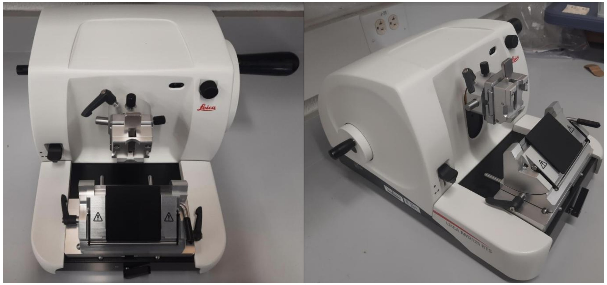

Assembly, operational standardization, and histological preparation workflow development for the Leica RM2125RTS rotary microtome used in biological microscopy studies.

**The work was conducted at the Socha Lab at Virginia Tech under the BIOTRANS IGEP program.**

<!--more-->

## Background & Motivation

Microtomes are precision instruments used to repeatedly slice extremely thin sections of embedded biological tissue for microscopy and imaging applications. This project focused on the assembly, operation, and protocol standardization of the **Leica RM2125RTS rotary microtome** for biological tissue sectioning and histological preparation. The broader objective was to help establish a self-sufficient tissue preparation workflow within the Socha Lab for insect respiration and microscopy-related research activities.

  <figure>
    
    <figcaption>
      Fully assembled Leica RM2125RTS rotary microtome configured for biological tissue sectioning and microscopy preparation.
    </figcaption>
  </figure>

---

## Instrument Assembly & Operational Training

The Leica RM2125RTS rotary microtome and all associated components were assembled and configured within the laboratory environment. Operational understanding of the instrument was developed through technical documentation and online training resources prior to formal manufacturer training availability.

The project involved:

- assembly of the microtome and accessory components
- operational familiarization and handling procedures
- tissue-sectioning workflow preparation
- laboratory setup standardization

---

## Histology Preparation Workflow Development

The project additionally focused on establishing chemical fixation and embedding protocols required for biological tissue sectioning and microscopy. Protocol development involved discussions and resource collection from collaborators and researchers across multiple institutions, including Virginia Tech, TU Dresden, and the University of Vienna.

The finalized workflow included preparation for:

- tissue fixation
- resin embedding
- ethanol processing
- embedding cassette preparation
- microscopy sectioning

These developments contributed toward establishing an in-house histology preparation pipeline for future biological imaging studies within the laboratory.

---

## Tools

- Leica RM2125RTS Rotary Microtome