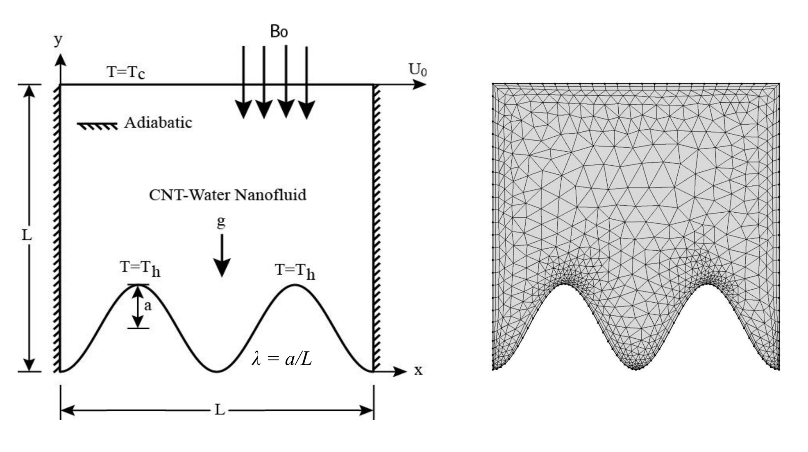
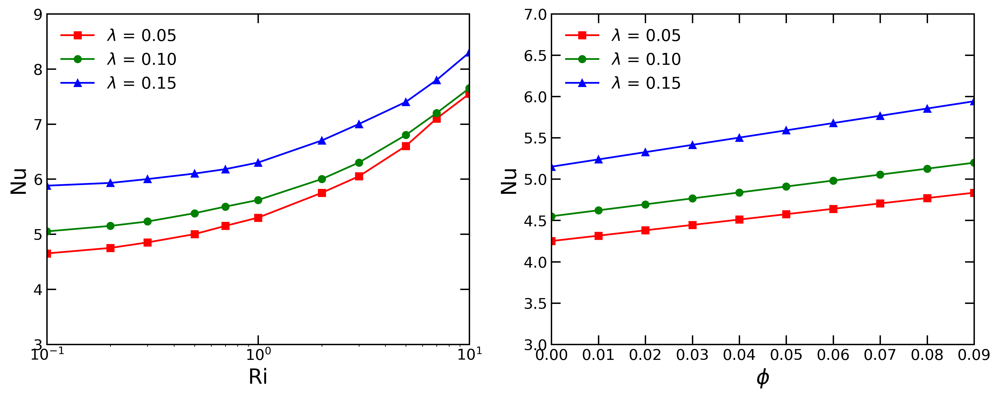

Numerical investigation of mixed convection heat transfer in a two-dimensional lid-driven cavity with a sinusoidally curved bottom wall using CNT-water nanofluid under the effects of magnetohydrodynamics (MHD) and porous media transport.

**This undergraduate thesis was completed at the Bangladesh University of Engineering and Technology (BUET).**

<!--more-->

## Background & Motivation

Enhancing heat transfer performance in compact thermal systems remains an important challenge in thermal engineering. Conventional working fluids such as water possess relatively low thermal conductivity, motivating the use of nanofluids for improved thermal transport.

This project investigated mixed convection inside a square lid-driven cavity with a sinusoidally heated bottom wall using **CNT-water nanofluid**. The study further incorporated the effects of:

- curved wall geometries
- magnetohydrodynamics (MHD)
- porous media transport
- varying nanoparticle concentrations

The primary objective was to understand how geometry, magnetic fields, and nanofluid properties influence flow structures and heat transfer enhancement.

---

## Numerical Framework

A two-dimensional lid-driven cavity model was developed using **COMSOL Multiphysics** to simulate steady laminar mixed convection within a porous enclosure.

The computational framework incorporated:

- incompressible Navier–Stokes equations
- energy transport equations
- Boussinesq approximation
- MHD body-force effects
- porous media resistance modeling

The upper wall of the cavity moved with constant velocity, while the sinusoidally curved bottom wall was maintained at a higher temperature to induce mixed convection.

The simulations employed:

- finite element discretization
- Galerkin weighted residual formulation
- non-uniform triangular meshing

  <figure>
    
    <figcaption>
      Computational domain and finite element mesh for the 2D lid-driven cavity with a sinusoidally heated bottom wall.
    </figcaption>
  </figure>

Key dimensionless parameters investigated included:

- Richardson number (\(Ri\))
- Hartmann number (\(Ha\))
- Darcy number (\(Da\))
- CNT nanoparticle volume fraction (\(\phi\))
- sinusoidal wall amplitude (\(\lambda\))

---

## Heat Transfer & Flow Analysis

The project focused on understanding the interaction between buoyancy-driven flow, lid-driven circulation, and enhanced thermal transport due to CNT nanoparticles.

The simulations analyzed:

- streamline evolution
- isotherm distributions
- velocity fields
- average Nusselt number variation
- magnetic suppression of convection
- porous-media-induced flow changes

The results demonstrated that:

- increasing CNT concentration enhanced heat transfer
- larger wall amplitudes improved thermal transport
- magnetic fields suppressed convection strength
- increasing Darcy number strengthened circulation patterns

  <figure>
    
    <figcaption>
      Variation of the average Nusselt number (\(Nu\)) for different sinusoidal wall amplitudes (\(\lambda\)) as a function of (a) Richardson number (\(Ri\)) and (b) CNT nanoparticle volume fraction (\(\phi\)). Increasing wall amplitude and nanoparticle concentration enhance convective heat transfer within the lid-driven cavity, resulting in higher average Nusselt numbers.
    </figcaption>
  </figure>

---

## Key Findings

- CNT-water nanofluids significantly enhanced convective heat transfer.
- Sinusoidally curved walls promoted stronger thermal mixing.
- Increasing nanoparticle concentration improved average Nusselt number.
- Magnetic fields reduced convective circulation strength through Lorentz-force suppression.
- Porous media permeability strongly influenced flow structure and heat transfer characteristics.

---

## Conference Paper

Mohieminul Islam Khan, Khan Md. Rabbi, Saadbin Khan, M. A. H. Mamun (2016). [Mixed convection analysis in lid-driven cavity with sinusoidally curved bottom wall using CNT-water nanofluid](/publications/c_khan2016). In: *AIP Conference Proceedings 1754*(1), p.040015.

---

## Tools

- COMSOL Multiphysics
- Finite Element Method (FEM)
- Galerkin Weighted Residual Method
- Tecplot