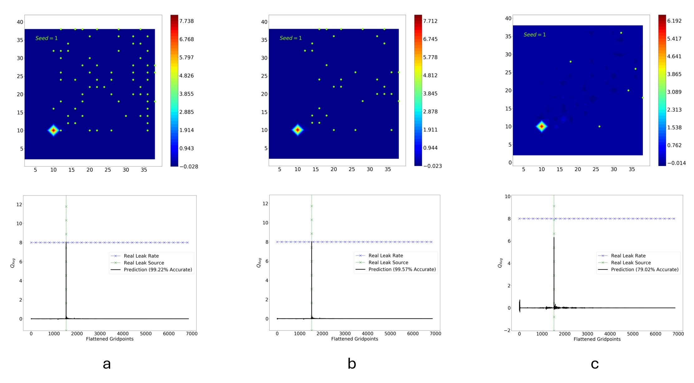

Physics-informed atmospheric transport and inverse modeling framework for environmental hazard detection using sparse reconstruction and advection–diffusion transport modeling.

**The work was conducted at Oklahoma State University under the Baker Hughes General Electric (BHGE) funded *'LUMEN'* project.**

<!--more-->

## Background & Motivation

Atmospheric dispersion modeling is essential for tracking hazardous contaminant transport and detecting potentially dangerous gas leaks in ambient environments.

  <figure>
    <video controls autoplay loop muted playsinline style="width:100%; height:auto;">
      <source src="plume_TE_general_ed.mp4" type="video/mp4">
    </video>
    <figcaption>
      Atmospheric plume modeled using the advection–diffusion transport equation.
    </figcaption>
  </figure>

---

## Forward Model Framework

Two complementary atmospheric transport models were compared:

- **Gaussian Dispersion (GD)** model
  - Fast analytical approximation
  - Steady-state assumptions
  - Simplified atmospheric transport physics

- **Transport Equation (TE)** model
  - Unsteady advection–diffusion transport equation
  - Finite-difference numerical framework developed in Python
  - Captures transient plume evolution and diffusion dynamics

The project systematically investigated how simplified Gaussian plume models deviate from higher-fidelity transport equation simulations. 
Although Gaussian plume model is computationally efficient, it fails to capture the transient transport effects as evident in the following videos that we generated from our models.

  

    <figure>
      <video controls autoplay loop muted playsinline style="width:100%; height:auto;">
        <source src="plume_GP_static_ed.mp4" type="video/mp4">
      </video>
      <figcaption>
        Gaussian Dispersion (GD) model under stationary wind conditions.
      </figcaption>
    </figure>
  

  

    <figure>
      <video controls autoplay loop muted playsinline style="width:100%; height:auto;">
        <source src="plume_TE_static_ed.mp4" type="video/mp4">
      </video>
      <figcaption>
        Transport Equation (TE) model under stationary wind conditions.
      </figcaption>
    </figure>
  

  

    <figure>
      <video controls autoplay loop muted playsinline style="width:100%; height:auto;">
        <source src="plume_GP_moving_ed.mp4" type="video/mp4">
      </video>
      <figcaption>
        Gaussian Dispersion (GD) model with dynamically varying wind direction.
      </figcaption>
    </figure>
  

  

    <figure>
      <video controls autoplay loop muted playsinline style="width:100%; height:auto;">
        <source src="plume_TE_moving_ed.mp4" type="video/mp4">
      </video>
      <figcaption>
        Transport Equation (TE) model with dynamically varying wind direction.
      </figcaption>
    </figure>
  

---

## Inverse Modeling & Sparse Reconstruction

The major challenge of the project was determining whether contaminant source locations and leak strengths could be recovered from highly sparse atmospheric measurements.

To address this, a physics-informed inverse modeling framework was developed using:

- Proper Orthogonal Decomposition (POD)
- Singular Value Decomposition (SVD)
- Sparse sensing
- Reduced-order reconstruction

Using only a small amount of concentration data, the framework can simultaneous recover:

- contaminant source location
- leak intensity
- approximate concentration fields

  <figure>
    
    <figcaption>
      Sparse reconstruction results using (a) 1% and (b) 0.5% shows 99% accuracy, while (c) 0.1% data yield 92% accuracy for source localization.
    </figcaption>
  </figure>

---

## Key Findings

- Gaussian plume models poorly approximate transient evolution
- Sparse reconstruction recovers source locations with 100% accuracy
- Leak-rate is predicted with 92% accuracy with only 0.1% data
- 0.5% and 1% sensor data yield >99% accuracy

---

## Conference Presentation

- Saadbin Khan, Balaji Jayaraman (2018). [Assessment of atmospheric plume source inversion using sparse reconstruction and Gaussian dispersion](/presentations/osu_symp_khan2018). In: *2nd Annual OSU MAE Graduate Research Symposium*. Stillwater, OK, USA: Oklahoma State University.

---

## Programming Language

- Python