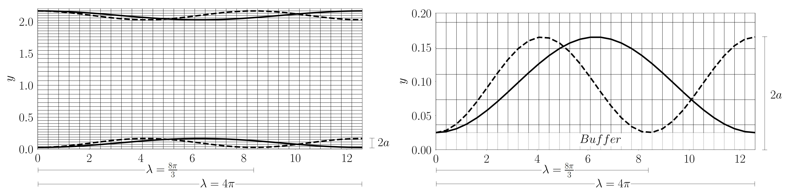
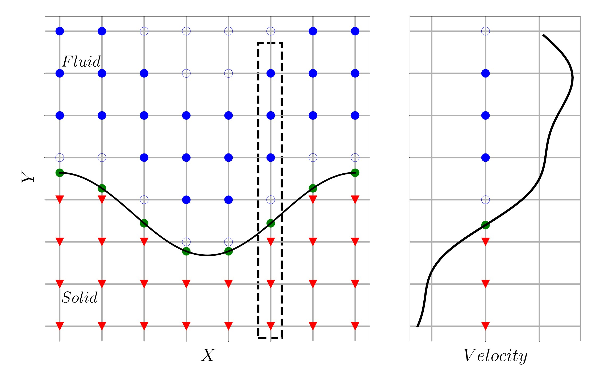
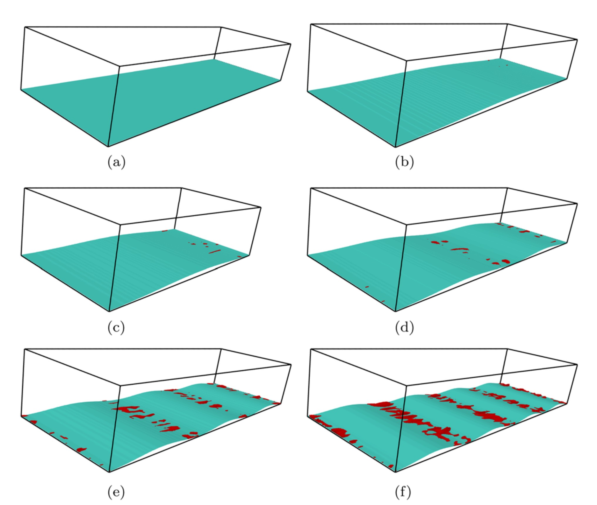

This project investigates turbulent flow behavior over wavy-wall geometries using Direct Numerical Simulation (DNS), high-order numerical methods, and MPI-parallelized scientific computing. The work focuses on understanding how surface waviness alters near-wall turbulence structures, Reynolds stresses, and transport mechanisms relative to canonical flat-wall turbulent channel flows.

**This project was supported by NASA Oklahoma EPSCoR.**

<!--more-->

## Background & Motivation

Surface roughness and geometric waviness strongly influence turbulent transport, drag generation, and near-wall coherent structures in engineering and environmental flows. While conventional turbulence models often rely on simplified wall assumptions, realistic surfaces can fundamentally alter turbulence production and energy redistribution mechanisms.

This project investigates turbulent channel flow over sinusoidal wavy surfaces to better understand the interaction between complex wall geometry and fully resolved turbulent flow structures.

---

## Numerical Framework

### Wavy-Wall Geometry Development

The computational domain was developed using sinusoidal wall geometries designed to mimic periodically varying surface topography in turbulent channel flow.

  <figure>
    
    <figcaption>
      Illustration of the Cartesian grid with the immersed boundaries of different shapes (left) and a close-up of the buffer region (right).
    </figcaption>
  </figure>

---

### Direct Numerical Simulation Framework

The simulations were performed using Direct Numerical Simulation (DNS), where all relevant turbulent scales were fully resolved without turbulence modeling approximations.

The numerical framework incorporated:

- High-order Padé finite-difference schemes for spatial discretization
- Immersed Boundary Method (IBM) for representing complex wavy-wall geometries
- Highly parallelized MPI-based computation for large-scale turbulence simulations
- Three-dimensional incompressible Navier–Stokes solvers
- Large-scale HPC computations on university supercomputing clusters

The DNS solver was implemented and modified in a MPI-parallelized computing environment to accurately capture near-wall turbulent structures and flow instabilities.

  <figure>
    
    <figcaption>
      Illustration of 1D polynomial reconstruction based on Lagrangian polynomial. The 2D grid distribution with the immersed boundary (left) and the 1D velocity reconstruction along the vertical line (right) is shown.
    </figcaption>
  </figure>

---

## Turbulence Analysis & Flow Physics

The simulations focused on analyzing how wavy-wall geometries modify:

- Reynolds stress distributions
- Near-wall coherent structures
- Turbulence production mechanisms
- Velocity fluctuations
- Flow separation and recirculation behavior
- Streamwise vortex dynamics
- Energy redistribution within the turbulent boundary layer

Comparisons against canonical flat-wall turbulent channel flows revealed substantial deviations in turbulence structure and transport behavior induced by surface waviness.

  <figure>
    
    <figcaption>
      Instantaneous flow separation for different wave steepness factors with (a) \( \zeta = 0 \), (b) \( \zeta = 0.011 \), (c) \( \zeta = 0.017 \), (d) \( \zeta = 0.022 \), (e) \( \zeta = 0.033 \), and (f) \( \zeta = 0.044 \). The separation regions are highlighted in red over the cyan wavy surfaces.
    </figcaption>
  </figure>

## Gallery

The following visualizations show instantaneous turbulent flow quantities for different surface steepness factors, \( \zeta \). Here, \( \zeta = 0 \) corresponds to a canonical flat-wall turbulent channel, while \( \zeta = 0.01 \), \( 0.02 \), and \( 0.04 \) represent progressively increasing wavy-wall steepness.

  <figure>
    <video controls autoplay loop muted playsinline style="width:100%; height:auto;">
      <source src="ux_and_sep_4.5x.mp4" type="video/mp4">
    </video>
    <figcaption>
      Instantaneous streamwise velocity field showing flow separation regions highlighted in cyan near the wavy surface.
    </figcaption>
  </figure>

  <figure>
    <video controls autoplay loop muted playsinline style="width:100%; height:auto;">
      <source src="vorticity_4.5x.mp4" type="video/mp4">
    </video>
    <figcaption>
      Instantaneous vorticity field illustrating near-wall rotational structures and turbulence generation mechanisms.
    </figcaption>
  </figure>

  <figure>
    <video controls autoplay loop muted playsinline style="width:100%; height:auto;">
      <source src="Q_4.5x.mp4" type="video/mp4">
    </video>
    <figcaption>
      Q-criterion visualization of coherent vortical structures generated by the wavy-wall turbulent flow.
    </figcaption>
  </figure>

  <figure>
    <video controls autoplay loop muted playsinline style="width:100%; height:auto;">
      <source src="pp_4.5x.mp4" type="video/mp4">
    </video>
    <figcaption>
      Instantaneous pressure fluctuation field showing spatial pressure redistribution induced by surface waviness and turbulence interactions.
    </figcaption>
  </figure>

## Key Findings

The simulations demonstrated that surface waviness strongly alters turbulent transport dynamics through geometry-induced modifications of near-wall flow structures. Key observations included:

- Enhanced Reynolds stress production near wavy surfaces
- Strong modulation of coherent near-wall turbulence structures
- Geometry-driven redistribution of turbulent kinetic energy
- Significant deviations from classical flat-wall turbulence behavior

---

## Journal Publications

- Balaji Jayaraman, Saadbin Khan (2020). [Direct numerical simulation of turbulence over two-dimensional waves](/publications/J_jayaraman2020). *AIP Advances* 10, 025034.

- Saadbin Khan, Balaji Jayaraman (2019). [Statistical structure and deviations from equilibrium in wavy channel turbulence](/publications/J_khan2019). *Fluids* 4(3), 161.

## Tools & Technologies

**Simulation & Numerical Methods**
- Direct Numerical Simulation (DNS)
- High-Order Finite Difference Methods (FDM)
- Immersed Boundary Method (IBM)

**CFD Software**
- Customized Incompact3d (Currently [Xcompact3d](https://www.incompact3d.com/))
- ANSYS Fluent

**Programming & Analysis**
- Fortran
- Python

**Visualization**
- ParaView

**Computing**
- Linux
- HPC Clusters
- OpenMPI