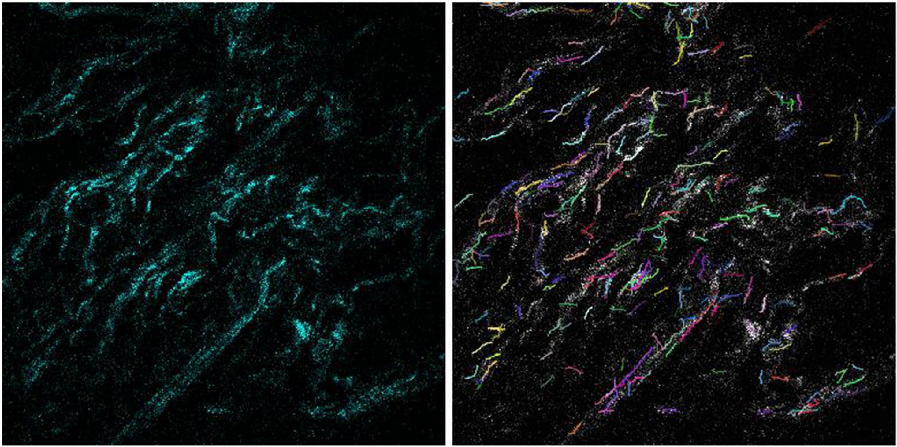
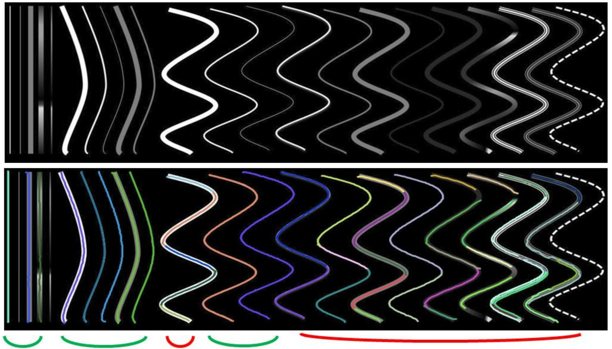
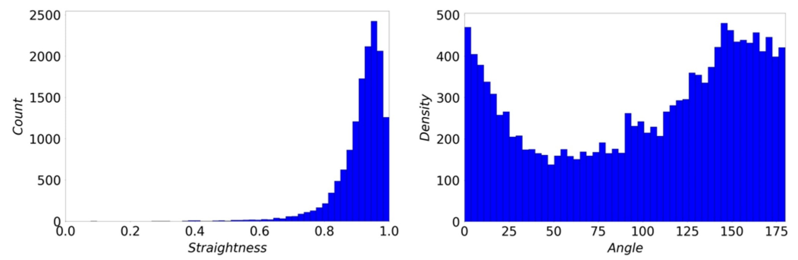

Quantitative analysis of collagen fiber waviness and orientation from second harmonic generation (SHG) microscopy images using automated fiber extraction and image-processing techniques.

**The work was conducted at the STRETCH Lab at Virginia Tech under the BIOTRANS IGEP program.**

<!--more-->

## Background & Motivation

Collagen fibers are the primary structural components of ligaments and play a critical role in determining tissue mechanical response. In this project, we investigated the waviness and orientation of collagen fibers within uterosacral ligaments (USL), which are important support structures for pelvic organs. The primary objective of this project was to quantify collagen fiber waviness from SHG microscopy images and evaluate the limitations of automated fiber tracing algorithms.

  <figure>
    
    <figcaption>
      Fiber extraction from an SHG image using CT-FIRE.
      Source:
      <a href="https://doi.org/10.1007/s42600-022-00250-y" target="_blank">
      Nejim et al., 2022.
      </a>
    </figcaption>

  </figure>

---

## Automated Fiber Tracing & Software Evaluation

Second Harmonic Generation (SHG) microscopy was used to image collagen fiber networks within ligament tissue samples. Fiber waviness was characterized using:

- fiber straightness
- fiber orientation
- extracted fiber length
- local curvature characteristics

Fiber extraction and tracing were performed using CT-FIRE to automatically identify collagen fiber segments from SHG images.

The project investigated:

- effectiveness of automated tracing
- influence of waviness on extraction quality
- effects of varying fiber thickness and opacity
- limitations of segmentation-based quantification

The robustness of CT-FIRE was further evaluated using synthetic curves with varying parameters. The study demonstrated that highly wavy fibers with non-uniform brightness are often incorrectly segmented into multiple shorter fragments.

  <figure>
    
    <figcaption>
      Effectiveness check for CT-FIRE using curves with varying width, waviness, and opacity. Markers at the bottom indicate curves that the algorithm succeeds (green) or fails (red) to trace. 
    </figcaption>
  </figure>

---

## Fiber Quantification

The analysis pipeline utilized **CT-FIRE**, a MATLAB-based fiber extraction framework designed for quantitative characterization of collagen architectures. Twenty SHG image samples obtained at different tissue depths were analyzed to quantify global collagen morphology statistics.

The analysis showed:

- mean fiber straightness of approximately 91%
- standard deviation near 8%
- dominant orientation alignment near loading directions

  <figure>
    
    <figcaption>
      Straightness and orientation statistics over 20 sample images.
    </figcaption>
  </figure>

---

## Key Findings

- Collagen fibers exhibited high overall straightness with preferred loading-direction alignment.
- Fiber waviness strongly influences tissue mechanical behavior.
- Automated fiber extraction accuracy deteriorates for highly wavy and non-uniform fibers.
- CT-FIRE segmentation limitations highlight opportunities for improved biomedical image-processing algorithms.

---

## Tools & Technologies

- MATLAB
- Python
- CT-FIRE
- SHG Microscopy
- Statistical Quantification